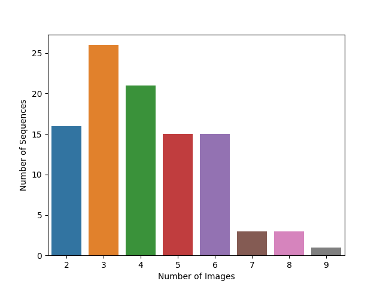
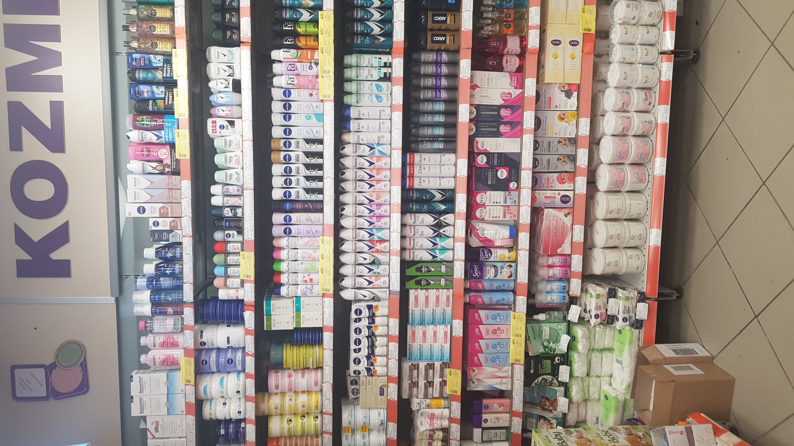
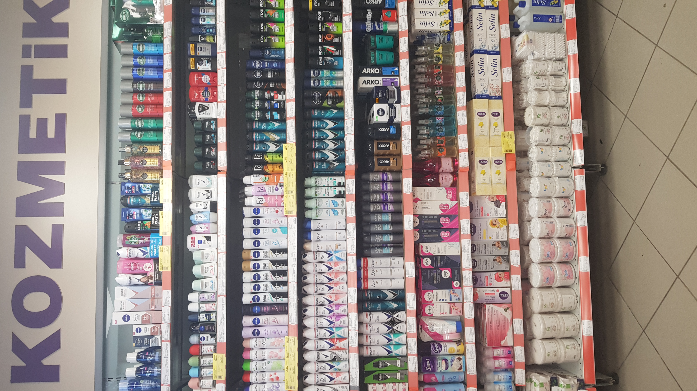
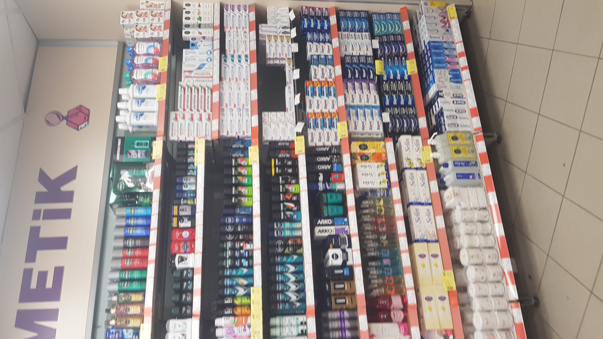
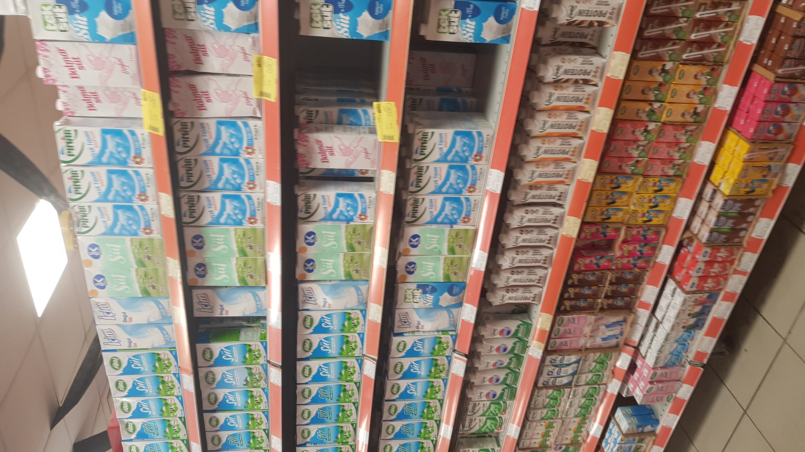
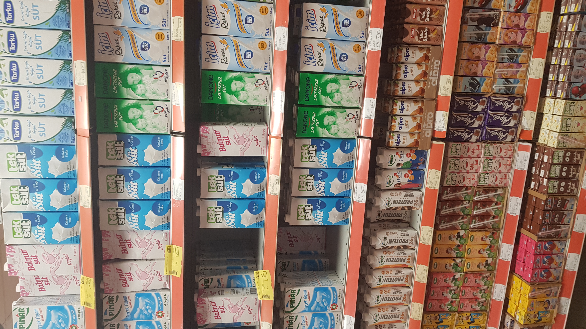
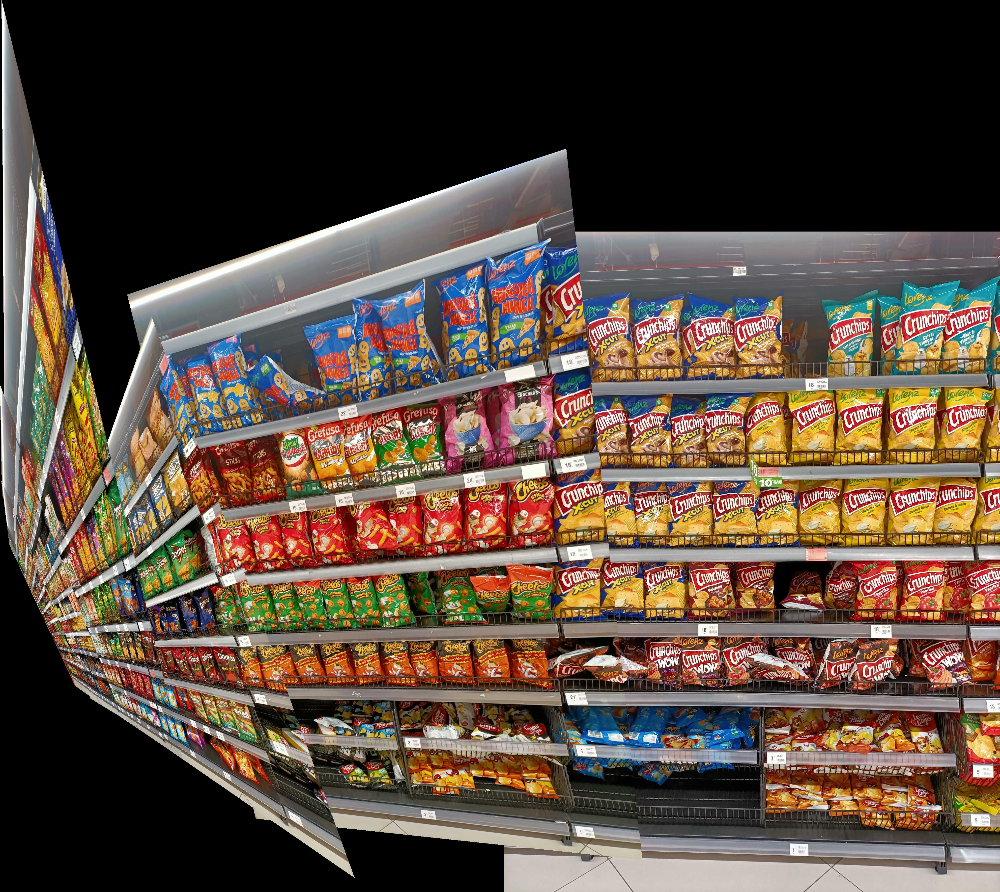
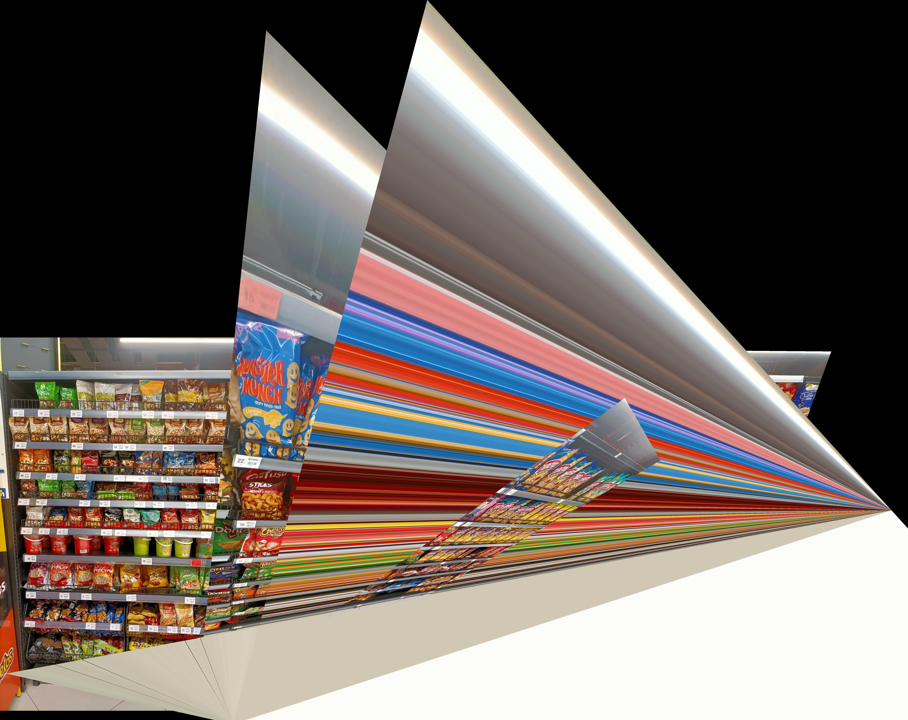
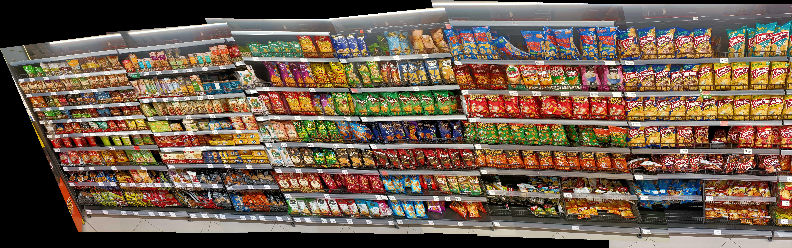

# RemRetail100
## Image Stitching Evaluation by Object Detection and Geometric Transformation in Retail

> [!IMPORTANT]
> Paper link will be coming soon.
 
#### Abstract
> Serial shelf images are frequently used in product availability research in the retail industry. However, in order to accurately count the products and determine the shelf arrangement in these serial images, these images must be stitched with image processing algorithms. Appropriate metrics are also needed to measure the quantitative quality of the stitched images. In this study, we developed a new method to measure the performance of algorithms used to stitch multiple images that have intersections. In this method, object detection was performed separately on individual images and on the stitched image. Image quality is calculated by looking at the overlap of the projection coordinates of the objects detected in the individual images and the stitched image. For this purpose, we prepared a dataset consisting of retail shelf scenes and tested our proposed method by comparing state-of-the-art stitched algorithms on this dataset. As a result of the tests, we showed numerically that deep learning-based methods achieve higher performance than classical methods.

This dataset could be used for image stitching benchmarking frameworks for retail. 

### Dataset Information
- This dataset consists of **100** scenes.
- This scenes has **413** images overall.
- Sequence image count distribution is shown below

## Dataset

> [!IMPORTANT]
> :arrow_down_small: [Download RemRetail100 Dataset](https://rempeople.com/datasets/remretail100.html)

 |  |
:--------------------------------------------:|:----------------------------------:|:-:

 |  |  | 
:--:|:----------------------------------:|:----------------------------------:|:--:

### Folder Structure
~~~
|_ assets
    ...
|_ scenes
    ...
|_ visualize.py
~~~

- **assets** folder holds the dataset assets for readme documentation
- **scenes** folder holds the scene images and annotations
- **visualizer.py** visualizes the dataset scene by scene with its annotations on canvas.
  > *You will need Pillow, numpy and opencv-python packages for visualize.py script.*

### Dataset Structure
~~~
|_ scenes
    |_ 1
        |_ images
            |_ 0001.jpg
            |_ 0002.jpg
            |_ 0003.jpg
            ...
        |_ annotations
            |_ 0001.json
            |_ 0002.json
            |_ 0003.json
            ...
    |_ 2
        |_ images
            |_ 0001.jpg
            |_ 0002.jpg
            |_ 0003.jpg
            ...
        |_ annotations
            |_ 0001.json
            |_ 0002.json
            |_ 0003.json
            ...
    |_ 3
        |_ images
            ...
        |_ annotations
            ...
    ...
~~~

#### Images
*Holds all the scene images in their own folder.*
#### Annotations
*Holds all the bounding boxes as list of dicts {xmin, ymin, xmax, ymax}*

~~~
    [
        {
            xmin: 0.0,
            ymin: 0.0,
            xmax: 10.0,
            ymax: 10.0,
        },
        {
            xmin: 10.0,
            ymin: 0.0,
            xmax: 20.0,
            ymax: 10.0,
        },
        {
            xmin: 20.0,
            ymin: 0.0,
            xmax: 30.0,
            ymax: 10.0,
        },
        ...
    ]

~~~

### Benchmarking Experiments
We evaluated 6 different combinations of algorithms. Traditional algorithms could be evaluated in cpu only. 
On the other hand, deep learning based algorithms run on both cpu and gpu.

Keypoint Detection | Feature Description | Keypoint Matching | Device |
:--:|:-------------------:|:--:|:--:
FAST |        SIFT         | BruteForce | CPU
BRISK |        SIFT         | BruteForce | CPU
BRISK |        BRISK        | BruteForce | CPU
SuperPoint |     SuperPoint      | LightGlue | GPU
DISK |        DISK         | LightGlue | GPU
SuperPoint |     SuperPoint      | GlueStick | GPU

FAST - SIFT |                 SuperPoint - LightGlue                 | SuperPoint - GlueStick
:--------------------------------------------:|:------------------------------------------------------:|:-:
 |  |
>*Stitching results of 3 algorithms on a scene.*

On the end of our evaluations, deep learning based algorithms gave more successfull results than traditional ones as expected.
Results are shown on the table below;
- **#Stitched Scenes**

    *Some algorithms could not even stitch some of the scenes. This metric is #Stitched Scenes*
- **F1**

    *Success rate that is gathered via the proposed metric on the paper.* 

Method | #Stitched Scenes | F1
:--:|:--:|:--:
FAST - SIFT | 84 | 0.7145
BRISK - SIFT | 85 | 0.7171
BRISK - BRISK | 81 | 0.6974
SuperPoint - LightGlue | 96 | 0.8159
DISK - LightGlue | 95 | 0.8039
SuperPoint - GlueStick | 98 | 0.8285
